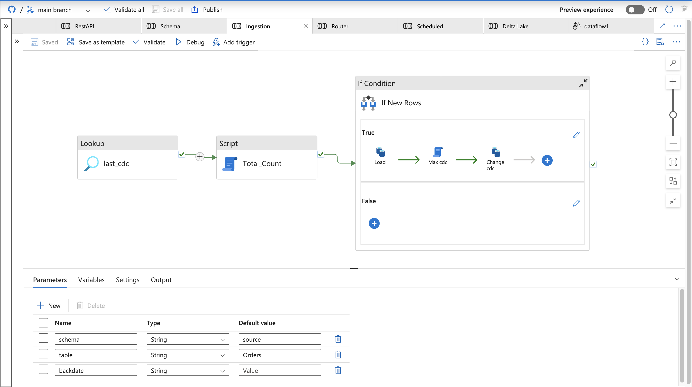
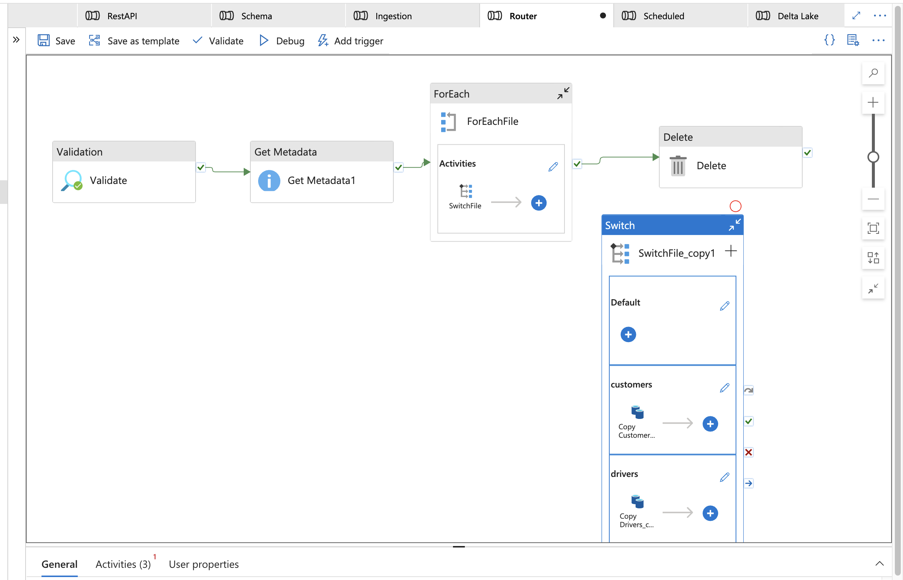
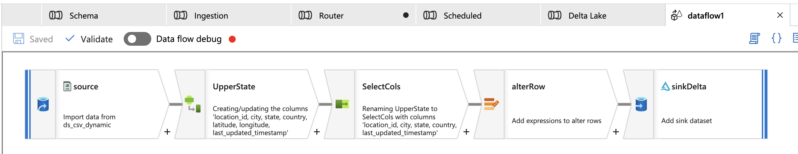

**ADFPRO** is a modular Azure Data Factory project designed to demonstrate real-world data engineering practices using fully parameterized and metadata-driven pipelines.

The goal of this repository is to build and version-control a complete ADF solution covering:

- Dynamic ingestion pipelines for multiple file formats (CSV, JSON, Parquet)
- Incremental and CDC-ready data ingestion into ADLS Gen2
- REST API integration with pagination and scheduling
- Schema validation and metadata auditing
- Delta Lake–ready data landing and curation
- CI/CD integration with GitHub for version-controlled ADF deployments

## Tech Stack

- Azure Data Factory (ADF)
- Azure Data Lake Storage Gen2
- Azure SQL Database
- GitHub (ADF integration and CI/CD)
- Power Query and Data Flows

## 🔄 Ingestion Pipeline

The **Ingestion** pipeline automates dynamic data ingestion into **Azure Data Lake Storage Gen2**, supporting both full and incremental (CDC) loads through metadata-driven control.



### Flow Overview
1. **Lookup (last_cdc)** – Fetches the last processed CDC or watermark value.  
2. **Script (Total_Count)** – Runs a SQL query to get the latest CDC value or record count.  
3. **If Condition (If New Rows)** – Compares CDC values:  
   - **True branch:** Loads new rows, updates max CDC, and commits the new checkpoint.  
   - **False branch:** Skips load when no changes are found.

### Parameters
| Name | Type | Default | Description |
|------|------|----------|-------------|
| `schema` | String | `source` | Source schema name |
| `table` | String | `Orders` | Target table for ingestion |
| `backdate` | String | `Value` | Optional for backdated loads |

**Highlights:**  
- Parameterized for multiple sources and tables.  
- Uses metadata tables for CDC tracking.  
- Integrates easily with the **Scheduled** orchestration pipeline.

## 🔁 Router Pipeline


The **Router** pipeline serves as the central controller for all data ingestion workflows.  
It dynamically validates, enumerates, routes, and cleans up files using a fully metadata-driven design.



### Flow Overview
1. **Validation** – Confirms that the source path and configuration are valid before execution.  
2. **Get Metadata** – Extracts metadata (e.g., file names, folder hierarchy) from the defined container.  
3. **ForEach (ForEachFile)** – Iterates over each file returned from the metadata activity using:  
   ```text
   @activity('Get Metadata1').output.childItems
   Inside the loop, a SwitchFile activity determines the processing logic based on file type or source name.
4. **Delete** - Cleans up successfully processed files from the source container to maintain a clean workspace.

## 🧮 Delta Lake Pipeline

The **Delta Lake** pipeline forms the transformation and curation layer of the data engineering workflow.  
It executes a **Mapping Data Flow** (`dataflow1`) that transforms raw ingested data into optimized Delta tables ready for analytics.



### Flow Overview
1. **Source:** Imports data dynamically from the `ds_csv_dynamic` dataset.  
2. **UpperState:** Cleans and standardizes fields like `city`, `state`, `country`, and `timestamp`.  
3. **SelectCols:** Renames and filters key columns for downstream consumption.  
4. **AlterRow:** Applies conditional logic to modify or upsert rows.  
5. **SinkDelta:** Writes curated data into **Delta format** in ADLS Gen2 for efficient querying and analytics.

### Highlights
- Demonstrates end-to-end ELT transformations using **ADF Mapping Data Flows**.  
- Converts raw CSV data into optimized Delta tables with schema consistency.  
- Acts as the curated layer in the modern data lake architecture.  
- Fully integrated with the **Router** and **Ingestion** pipelines for orchestrated execution.


## 🕒 Scheduled Pipeline

The **Scheduled** pipeline manages the orchestration and automation layer of the project.  
It executes key pipelines such as *Ingestion* and *Router* on defined schedules and triggers alert notifications via a **Web activity** once execution completes.  
Parameters for schema, table, and backdate values make it reusable across multiple datasets.

**Highlights**
- Automates pipeline execution using triggers.  
- Integrates with webhooks or Logic Apps for real-time alerts.  
- Supports parameterized execution of dependent pipelines.

---

## 🧩 Schema Pipeline

The **Schema** pipeline validates and enforces data structure consistency before ingestion.  
It retrieves metadata through a **Get Metadata** activity, then iterates through schema definitions in a **ForEach** loop to ensure each dataset aligns with its expected structure.  
The validation step prevents downstream errors caused by column drift or mismatched data types.

**Highlights**
- Enforces schema integrity for multiple tables.  
- Uses metadata-driven configuration for dynamic schema mapping.  
- Performs pre-ingestion validation to maintain data quality.

---

## 🌐 REST API Pipeline

The **REST API** pipeline ingests external data through HTTP endpoints and integrates it into the data lake.  
A **Web activity** fetches data from a REST endpoint, and a **Copy Data** activity writes the response into Azure Data Lake in a structured format for further transformation.  
This allows combining internal and external data sources into a unified analytics layer.

**Highlights**
- Handles REST API connections and pagination.  
- Copies data directly into ADLS Gen2 for downstream processing.  
- Fully parameterized for dynamic endpoints and authentication headers.


